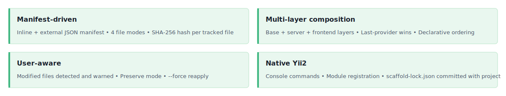

<!-- markdownlint-disable MD041 -->
<p align="center">
    <picture>
        <source media="(prefers-color-scheme: dark)" srcset="https://www.yiiframework.com/image/design/logo/yii3_full_for_dark.svg">
        <source media="(prefers-color-scheme: light)" srcset="https://www.yiiframework.com/image/design/logo/yii3_full_for_light.svg">
        
    </picture>
    <h1 align="center">Scaffold</h1>
    <br>
</p>
<!-- markdownlint-enable MD041 -->

<p align="center">
    <a href="https://github.com/yii2-extensions/scaffold/actions/workflows/build.yml" target="_blank">
        
    </a>
    <a href="https://github.com/yii2-extensions/scaffold/actions/workflows/mutation.yml" target="_blank">
        
    </a>
    <a href="https://github.com/yii2-extensions/scaffold/actions/workflows/static.yml" target="_blank">
        
    </a>
</p>

<p align="center">
    <strong>Declarative multi-layer file scaffolding for Yii2 projects</strong>
</p>

## Features

<picture>
    <source media="(max-width: 767px)" srcset="./docs/svgs/features-mobile.svg">
    
</picture>

## Installation

```bash
composer require yii2-extensions/scaffold
composer config allow-plugins.yii2-extensions/scaffold true
```

Declare the providers that are permitted to write files into your project:

```json
{
    "extra": {
        "scaffold": {
            "allowed-packages": [
                "yii2-extensions/app-base-scaffold"
            ]
        }
    }
}
```

Run `composer install` to trigger the scaffold process. Commit `scaffold-lock.json` to version control.

## Configuration

Minimal `composer.json` for a project using one scaffold provider:

```json
{
    "require": {
        "yii2-extensions/scaffold": "^0.1",
        "yii2-extensions/app-base-scaffold": "^0.1"
    },
    "config": {
        "allow-plugins": {
            "yii2-extensions/scaffold": true
        }
    },
    "extra": {
        "scaffold": {
            "allowed-packages": [
                "yii2-extensions/app-base-scaffold"
            ]
        }
    }
}
```

Register the console module in `config/console.php` to enable `yii scaffold/*` commands:

```php
'modules' => [
    'scaffold' => \yii\scaffold\Module::class,
],
```

## Documentation

- 📥 [Installation Guide](docs/installation.md)
- ⚙️ [Configuration Reference](docs/configuration.md)
- 📦 [Creating Providers](docs/providers.md)
- 🔀 [File Modes](docs/modes.md)
- 🖥️ [Console Commands](docs/console.md)

## Package information

[](https://www.php.net/releases/8.3/en.php)
[](https://github.com/yiisoft/yii2/tree/22.0)
[](https://packagist.org/packages/yii2-extensions/scaffold)
[](https://packagist.org/packages/yii2-extensions/scaffold)

## Quality code

[](https://github.com/yii2-extensions/scaffold/actions/workflows/static.yml)
[](https://github.com/yii2-extensions/scaffold/actions/workflows/linter.yml)
[](https://github.styleci.io/repos/scaffold?branch=main)

## Our social networks

[](https://x.com/Terabytesoftw)

## License

[](LICENSE)
